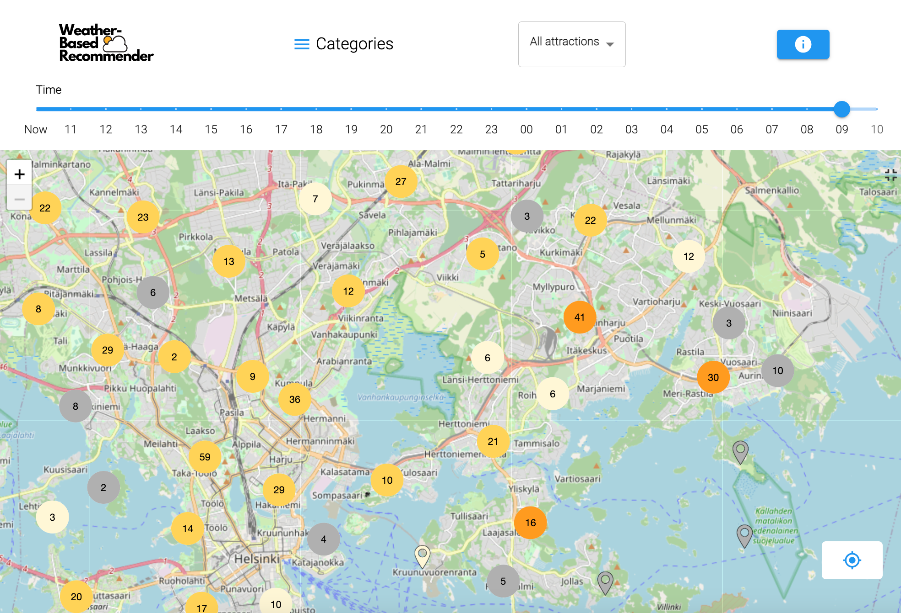
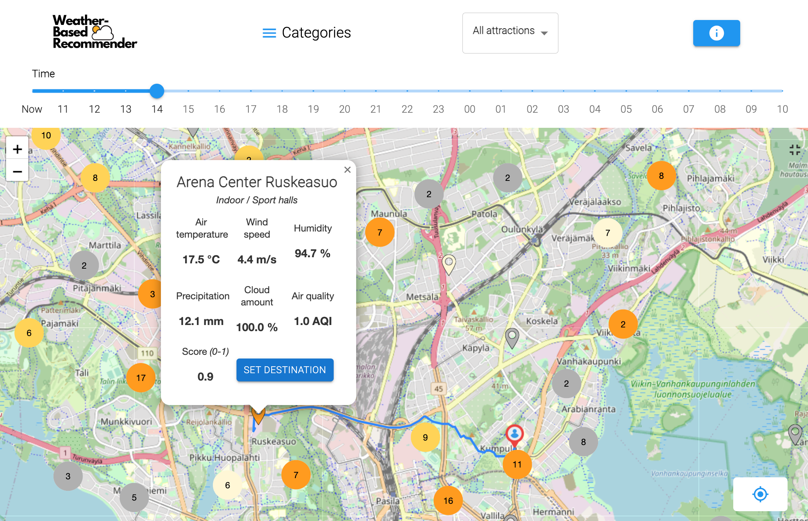

# Features

This application helps you to find the most interesting sports facilities (point of interests, POIs) in the Helsinki area, taking into account the weather conditions both now and within the next 24 hours. Weather information is updated once an hour.

The application is responsive, meaning that the user interface adapts to the screen size of the device and can be used both with desktop and mobile devices.

Please note that when the application is launched, the data update process takes approximately 1-2 minutes. 

## Navigating on the Map

There is a zoom function in the top right corner of the map, which allows you to zoom in and out of the visible area.

The icon in the top left corner of the map brings the map into full view, hiding the header.

The map displays information for 625 sports facilities. To avoid displaying too much information at once, point-of-interest data is clustered in form of circles. Clicking on a cluster circle allows you to zoom in on the area for more details. The number visible in the middle of a cluster indicates how many sports facilities are grouped within it.

## Recommendations

Each sports facility has a calculated recommendation score. Scores range from zero to one, with one being the best value.

Both the icon for the sports facility and the cluster colors illustrate the strength of the recommendations. Bright orange indicates the most interesting locations for the desired time period. Gray signifies that the location is currently not interesting based on weather conditions. The color of the cluster is determined by the best-scoring location within it.

## Timeline

At the top of the page, there is a timeline that, when adjusted, shows how the recommendations are expected to evolve in the coming hours based on weather forecasts. Forecast data is updated every hour.

On larger screens, a 24-hour timeline is visible. In the mobile interface, forecast data is displayed for the next 10 hours only.

## Point-of-Interest Information

Detailed information about a sports facility can be accessed by clicking on the location.

For each location, information from the nearest weather station is provided:

* Temperature
* Wind speed
* Humidity
* Cloud cover
* Precipitation
* Air quality
* Score

In addition, the name and category of the location are displayed.

## Location Filtering / Personalization

Sport facilities on the map can be filtered based on accessibility.

The following options are available for selection:
* All attractions
* Rollator accessible
* Stroller accessible
* Wheelchair accessible
* Reduced mobility
* Visually impared

By choosing a category, the displayed sports facility types can be narrowed down. Choices can be further restricted to the following:
* All
* Sport halls
* Open air pools and beaches
* Athletic fields and venues
* Neighbourhood ports areas
* Fitness training parks

## Routing to Desired Destination

By clicking on the icon in the bottom right corner, a character is displayed on the map. It can be moved by dragging to the desired starting point. By default, the character is placed in Kumpula.

After selecting a starting point, the user can open information pop-up about an interesting sports facility and click the "Set destination" button. Afterward, the recommended route from the Green Paths service is drawn on the map.

## Wind Warning

If weather conditions are dangerous, the application does not recommend sports facilities. Currently, a wind warning is in effect, which is displayed if the wind speed in the Helsinki area exceeds 18 meters per second.

## Simulator

For administrators, a separate interface is available at http://128.214.253.51/admin to test how different weather parameters affect recommendations.

